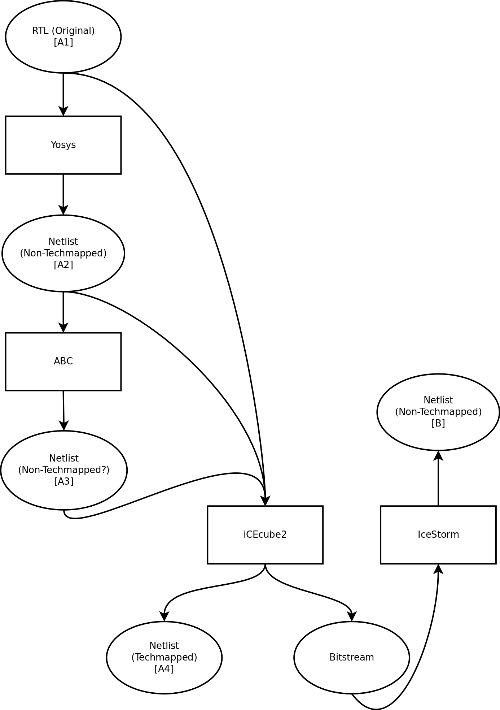

# IceMachine

Source code and resources for the IceMachine team.

The following diagram shows different possible compilation flows. For example, to get a reverse-engineered netlist (B), it is possible to take the original RTL (A1), pass it through iCEcube2 and pass the resulting bitstream through IceStorm. It is also possible to first run through Yosys to get a netlist (A2) before iCEcube2, etc.

 shows whether compilation has been sucessful from each of the A nodes on the above graph. For example, if we have been able to compile a benchmark going from A2 to B, the A2 spot for that benchmark will be marked green on this spreadsheet. To get editing permissions, contact Eli Cahill.
